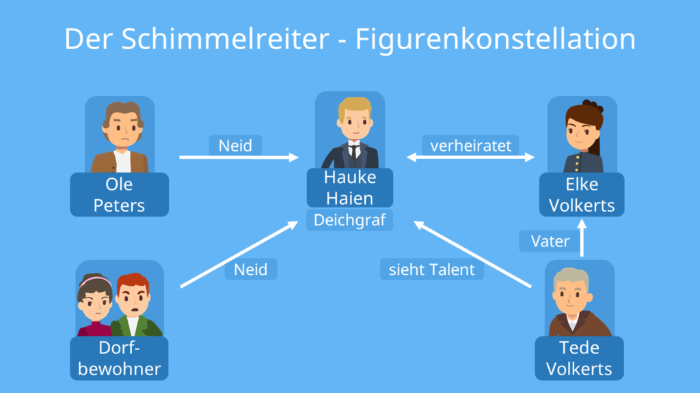
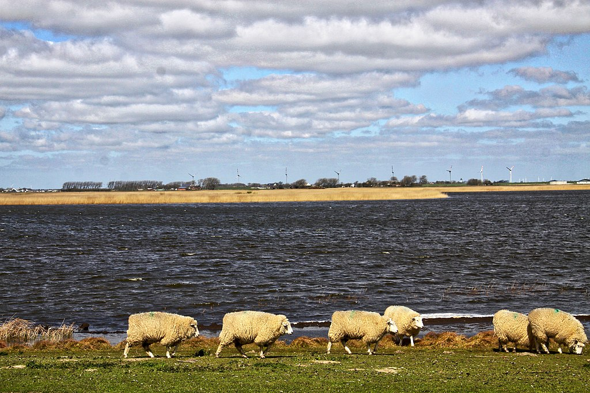

# Der Schimmelreiter
Jakob Hofer

---

## Die Fakten
- Autor: Theodor Storm
- Veröffentlichung: 1888
- basiert auf einer Sage
- Novelle (kurze Erzählung)
- erzählte Zeit: 1888, 1820, 1732 - 1756
  - Geschichte in Geschichte in Buch
- Erzählzeit: ~4h

---

---

## Terminologie
- Kleinknecht für Haus- und Hofarbeiten und Kleinvieh zuständig
- Großknecht kümmert sich um Pferde
- Deich = ~Damm / Schutz vor Hochwasser
- Deichgraf ist für Unterhaltung und Anlage dieser zuständig
- Koog = ein durch Eindeichung dem Meere abgewonnener Landbezirk

---

## Inhalt
- Theodor Storm erzählt Geschichte...
  - Ich-Perspektive

---

## Inhalt
- Mann reitet von Freunden in eine Stadt
  - nordfriesischer Deich
  - direkt neben Wattmeer der Nordsee
  - schlechtes Wetter
- Gestalt reitet lautlos vorbei
  - "hochbeiniger, hagerer Schimmel"

---

## Inhalt
- Reiter kehrt in Wirtshaus ein
- erwähnt Begegnung mit Schimmelreiter
  - Umsitzende hellhörig
- Erzählung vom Schulmeister...
  - Geschichte in der Geschichte.. im Buch

---

## Inhalt
- Geschichte von Hauke Haien
  - erst 15 Jahre alt
  - beschäftigt sich mit Deichen und dem Meer
  - intelligent, interessiert an Mathematik
  - wenig Sozialkontakt
  - konzipiert starke Deiche
- wird durch Talent Helfer des Deichgrafen Tede Volkerts

---

## Inhalt
- wenig Stallhilfe, stattdessen Rechnen
- weckt Interesse von Elke (Tochter Tedes)
  - macht ihn bei Ole Peters, Großknecht, unbeliebt
- Hauke macht Elke Heiratsantrag
  - lehnt ab, da sie taktisch warten möchte

---

## Inhalt
- Hauke und Elkes Väter sterben
  - neuer Deichgraf benötigt
    - nur wohlhabende Bürger (Tradition)
- Ole Anwärter für Posten
- Elke verlautbart Verlobung
  - großer Besitztum
  - Hauke wird Deichgraf
  - Ole nur Bevollmächtigter

---

## Inhalt
- Hauke schreitet direkt zur Tat
- kontroverse Deklaration mancher Deiche als reperaturbedürftig
  - viel Geld involviert
- Spannungen
- Neid und Missgunst der Dorfbewohner

---

## Inhalt
- Hauke kauft Schimmel
- "rauhaarig und mager, dass man jede Rippe zählen konnte, und die Augen lagen ihm matt und eingefallen in den Schädelhöhlen"
- einige Pflege
- starke Bindung
- folgt Hauke aufs Wort
  - anderen weniger

---

## Inhalt
- bekanntes Geisterpferd plötzlich verschwunden
  - Verknüpfung mit dem Kauf Haukes
  - "Teufelspferd des Deichgrafen"
- Knecht fängt bei Ole Peters an
  - erzählt Geschichte
  - gutes Material für Peters

---

## Inhalt
- Hauke will neuen Deich bauen
- Unmut der Dorfbewohner
- weiser Bewohner überzeugt Gemeinde

---

## Inhalt
- Bau des Damms
- Hauke reitet nun auf Schimmel
  - Aufseher
  - "Frisch zu! Der Schimmelreiter kommt!"

---

## Inhalt
- Elke gebärt Wienke
- leidet daraufhin an Kindbettfieber
  - redet Irrsal
  - kennt weder Mann noch Helferin
  - entrinnt nur knapp dem Tod

---

## Inhalt
- Deich wird fertig
- "Hauke-Haien-Deich" + "Hauke-Haien-Kog"
- alter Deich macht Hauke Sorgen
- Hauke erkrankt
- nie dagewesene Stürme
- Hauke zu schwach um Verstärkung zu veranlassen

---

## Inhalt
- 1\. November 1756
- Hauke reitet los, um Deiche zu kontrollieren
- findet Arbeiter, die seinen Deich durchstechern
  - veranlasst von Ole Peters
  - Versuch, Druck von altem Deich zu nehmen
- Hauke verhindert dies
  - will eigenen Koog nicht überfluten

---

## Inhalt
- Hauke reitet zu altem Damm
- Stück löst sich direkt vor ihm
- Wasser strömt gen Stadt
- Elke und Wienke kommen mit Pferd und Wagen entgegen
- weiteres Stück löst sich - reist Familie mit sich
- Hauke stürzt sich in den Tod

---

## Analyse
- Motiv: Spannung zwischen Aberglauben - Aufklärung
- Sprache: der Zeit entsprechend
  - "Weib"
    - "das ist auch besser für ein altes Weib wie ich"
  - "frug sie leise"
- Mägde und Diener
- typische Rollenbilder

---

## Ehrung

- Hauke-Haien-Koog existiert wirklich
- Hauke einziger fiktionaler Namensgeber

---

## Eigene Meinung
- grundsätzlich gut
- anstrengend, für ein Referat zusammenzufassen
  - viele unnötige Nebenerzählungen
- Einblick in eine fremde, vergangene Welt
- grausliche Kater-Szene

---

 

# Vielen Dank für eure Aufmerksamkeit!
Quellen:
- Buch
- https://www.studysmarter.de/schule/deutsch/epische-texte/der-schimmelreiter/
- https://de.wikipedia.org/wiki/Hauke-Haien-Koog
